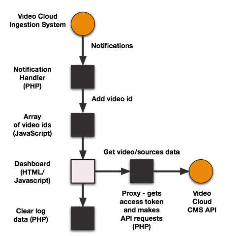

<h2>Dynamic Ingest dashboard</h2>

This section is a sample of using notifications to build a simple dashboard for the Brightcove Dynamic Ingest API. The handler parses notifications from the Dynamic Ingest API to identify processing complete notifications. It then adds the video id into an array in a JavaScript file. The dashboard itself is an HTML page that includes the array of processed video ids. It uses the ids to makes 2 requests to the [CMS API](//docs.brightcove.com/en/video-cloud/cms-api/getting-started/quick-start-cms.html) to get the video metadata and the array of sources (renditions). Whether renditions exist or not shows whether the ingest succeeded or failed. You can view working sample of the dashboard [here](//solutions.brightcove.com/bcls/di-api/di-log.html).

<h3>Changes you must make to app!</h3>

You must make the following changes to the app files before it will work for your account:

1. in `/ingest-dashboard/brightcove-learning-proxy.php`: insert the appropriate client_id and client_secret values in lines 26 and 27:

        $client_id     = "your_client_id_here";
        $client_secret = "your_client_secret_here";

2. in `/ingest-dashboard/di-log.html`: insert your Video Cloud account id in line 63:

        var account_id = your_account_id_here,

3. in your app to make Dynamic Ingest requests, include a `callbacks` array in the request body data, with the full URL to `callback-di.php` - for example:

        {"master":{"url":"videoURL"},"profile":"ingest-profile-name","callbacks": ["http://path_to_this_folder/ingest-dashboard/callbacks-di.php"]}

4. if you use the `di-tester.html` to test this app, you will need to enter your Video Cloud account id in line 135, and correct the path to `callbacks-di.php` in line 251:

        account_id = your_account_id_here,
        ...
        di_requestBody.value = '{"master":{"url":"' + selectedVideoURL + '"},"profile":"' + selectedProfile + '","callbacks": ["http://path_to_this_folder/ingest-dashboard/callbacks-di.php"]}'

<h3>Architecture</h3>

Here is the high-level architecture of the app: 

<h3>The app parts</h3>

The handler for notifications is built in PHP - it looks for processing complete notifications and adds the video id to an array in a separate JavaScript file:

<h4>Notification handler</h4>

<a href="https://gist.github.com/846bf4f1b8d52b442121">View the code</a>

<h4>JavaScript file:</h4>

<a href="https://gist.github.com/c4b36c1f826762be75f9">View the code</a>

<h4>Dashboard</h4>

The dashboard include the JavaScript file, and uses additional JavaScript to fetch data from the CMS API and write the results into a table:

<a href="https://gist.github.com/5f93d0f1fae7c4666867">View the code</a>

<h4>Proxy</h4>

The proxy, also built in PHP, takes the CMS API requests from the dashboard, gets an access token, and makes the API request, returning the data to the dashboard. The proxy is needed because client-side calls to the CMS-API are not allowed, as this would require exposing your client credentials:

<a href="https://gist.github.com/b0d5f05a328840851ce5">View the code</a>

<h4>Clear the log</h4>

This simple PHP app just restores the JavaScript file to its original state, clearing out the old video ids

<a href="https://gist.github.com/d013a4d44236054a2201">View the code</a>

